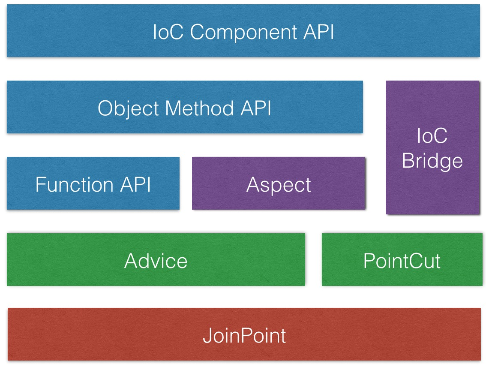

## 支持的特性

1. function 拦截
2. object method 拦截
3. ioc component method 拦截

## 总体架构

## 模块功能

### JoinPoint

连接点描述

### Advice

通知功能:

- BeforeAdvice: 前向
- AfterReturningAdvice 返回
- AfterThrowingAdvice 异常
- AroundAdvice 环绕

### PointCut

切点（连接点筛选）功能

- StringPointCut 字符串过滤匹配
- RegexPointCut 正则过滤匹配
- FunctionPointCut 函数过滤匹配

### Aspect

切面功能：PointCut 和 Advice 的高阶整合

### IoC Bridge

IoC 桥接支持

### Function API

提供针对函数执行拦截的API

### Object Method API

组合 Aspect，提供针对对象方法拦截的 API

### IoC Component API

基于IoC Bridge， 提供与 IoC 整合的配置语法

