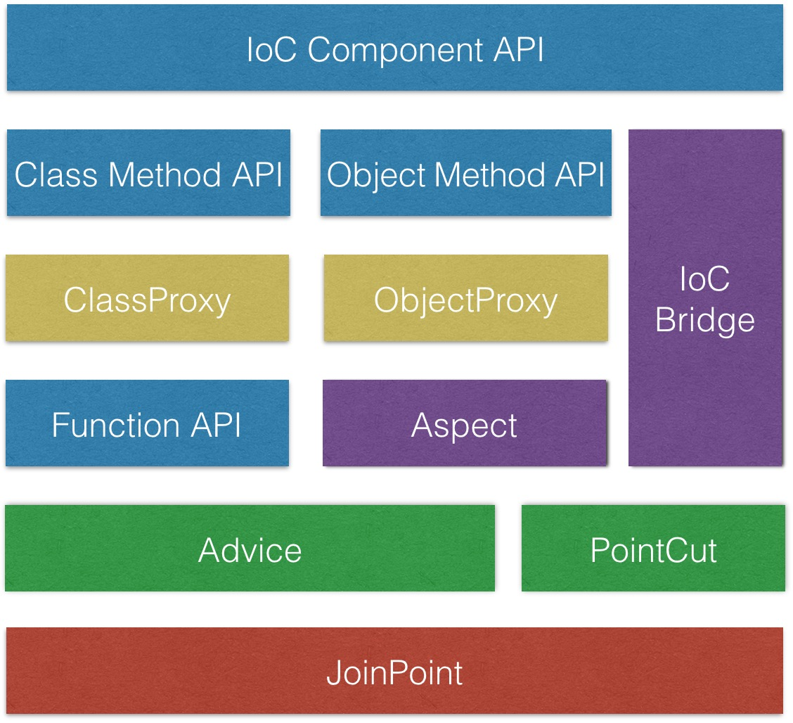

## 支持的特性

1. function 拦截
2. object method 拦截
3. Class method 拦截
4. ioc component method 拦截

## 总体架构


## 模块功能

### JoinPoint

连接点描述

### Advice

通知功能:

- BeforeAdvice: 前向
- AfterReturningAdvice 返回
- AfterThrowingAdvice 异常
- AroundAdvice 环绕

### PointCut

切点（连接点筛选）功能

- StringPointCut 字符串过滤匹配
- RegexPointCut 正则过滤匹配
- FunctionPointCut 函数过滤匹配

### Aspect

切面功能：PointCut 和 Advice 的高阶整合

### IoC Bridge

IoC 桥接支持

### Function API

提供针对函数执行拦截的API

#### before(functionToAdvise, beforeFunction)

返回一个新的函数, 执行逻辑为, 在 functionToAdvise 函数执行前, 执行 beforeFunction, beforeFunction 接收与 functionToAdvise 一致的参数 

```javascript
var functionToAdvise = function () {
    console.log('functionToAdvise exec');
};
var advisedFunction = aop.before(functionToAdvise, function () {
    console.log('arguments length:', argument.length);
});

// log:
// arguments length: 3
// functionToAdvise exec
advisedFunction(1, 2, 3); 
```

#### afterReturning(functionToAdvise, afterReturningFunction)

返回一个新的函数, 执行逻辑为, 在 functionToAdvise 函数正常返回后, 执行 afterReturningFunction, 
afterReturningFunction 接收 functionToAdvise 执行后的返回结果作为唯一参数

```javascript
var functionToAdvise = function () {
    console.log('functionToAdvise exec');
    return 'functionToAdvise';
};
var advisedFunction = aop.afterReturning(functionToAdvise, function (returnValue) {
    console.log('return value: ', returnValue);
});

// log:
// functionToAdvise exec
// return value: functionToAdvise
advisedFunction(); 
```

#### afterThrowing(functionToAdvise, afterThrowingFunction)

返回一个新的函数, 执行逻辑为, 在 functionToAdvise 函数抛出异常时, 执行 afterThrowingFunction, afterThrowingFunction 接收 functionToAdvise 抛出的异常对象作为唯一参数

```javascript
var functionToAdvise = function (throwError) {
    console.log('functionToAdvise exec');
    if(throwError) {
        throw new Error('functionToAdvise error');
    }
};
var advisedFunction = aop.afterThrowing(functionToAdvise, function (e) {
    console.log('execption: ', e.message);
});

// log:
// functionToAdvise exec
advisedFunction(); 

// log:
// functionToAdvise exec
// execption: functionToAdvise error
advisedFunction(true); 
```

#### after(functionToAdvise, afterFunction)

返回一个新的函数, 执行逻辑为, 在 functionToAdvise 函数正常返回或抛出异常时, 执行 afterFunction, 
afterFunction 接收 functionToAdvise 的返回结果或抛出的异常对象作为唯一参数

```javascript
var functionToAdvise = function (throwError) {
    console.log('functionToAdvise exec');
    if(throwError) {
        throw new Error('error');
    }
    else {
        return 'normal return';    
    }
};
var advisedFunction = aop.after(functionToAdvise, function (errorOrResult) {
    console.log('functionToAdvise result: ', e.message || errorOrResult);
});

// log:
// functionToAdvise exec
// functionToAdvise result: normal return
advisedFunction(); 

// log:
// functionToAdvise exec
// functionToAdvise result: error
advisedFunction(true); 
```

#### around(functionToAdvise, aroundFunction)

返回一个新的函数, 执行逻辑为, 执行 aroundFunction, aroundFunction 接收一个 ProceedingJoinPoint 对象作为参数, 调用其 process 方法将执行 functionToAdvise.
 
```javascript
var functionToAdvise = function () {
    console.log('functionToAdvise exec');
    return 'functionToAdvise return value';
};
var advisedFunction = aop.around(functionToAdvise, function (joinPoint) {
    console.log('before functionToAdvise exec');
    var result = joinPoint.proceed();
    console.log('functionToAdvise exec result: ', result);
    console.log('after functionToAdvise exec');
});

// log:
// before functionToAdvise exec
// functionToAdvise exec
// functionToAdvise exec result: functionToAdvise return value
// after functionToAdvise exec
advisedFunction(); 
``` 
 
#### ProceedingJoinPoint

```javascript
joinpoint = {
    // 函数被调用时的上下文
    target: <any type>,

    // 传给外层函数的参数
    args: Array,

    // 原方法名
    method: string,

    // 被调用时, 会调用被拦截的原函数
    // 未传入参数调用时, 会传入外层函数被调用时的原始参数,
    // 传参调用时候, 原始参数不会被传入
    proceed: Function
}
```


### Object Method API

组合 Aspect，提供针对对象方法拦截的 API

#### ObjectProxy
 
对象拦截代理

### Class Method API

组合 Aspect，提供针对Class方法拦截的 API

#### ClassProxy

类拦截代理

### IoC Component API

基于IoC Bridge， 提供与 IoC 整合的配置语法


